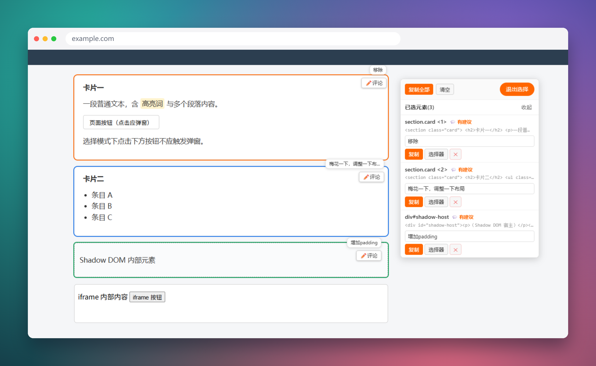

# SelectDom · 把「我想改这里」变成 AI 能读懂的精确定位

> 解决的核心问题：**用户与 AI 协作编写 UI 时，无法精确描述「要改页面上的哪个元素」**。

与 ChatGPT、Claude、Cursor、Copilot 等 AI 一起改界面时，最常卡住的往往不是写代码，而是那句「把列表里第三个按钮改红」。口头描述一旦元素重叠、同名、无 id，AI 就容易定位错。

SelectDom 是一个**零依赖的单文件 DOM 拾取工具**：注入任意网页后出现悬浮面板，悬停高亮、点击选中要改的元素，自动生成**唯一 CSS 选择器 + DOM 结构**，并附上你填写的**修改建议**。复制一段结构化文本粘贴给 AI，即可零歧义地告诉它「我说的是这个元素，请这样改」。



## 为什么需要它

当人用自然语言向 AI 描述 UI 位置时，常见三种歧义：

- **描述模糊**：「上面的那个按钮」——页面上有六个按钮，AI 只能猜；
- **定位不稳**：「第三个列表项」——顺序、嵌套一换就指错；
- **无唯一标识**：元素既没 `id` 也没有唯一 `class`，光给截图 AI 也难锁定。

SelectDom 在浏览器里把人指「这里」的动作，自动翻译成 AI 可直接消费的 `选择器 + 结构 + 建议`，彻底跳过「靠猜和截图沟通位置」这一步。

## 功能特性

- **可视化拾取**：点击「选择元素」进入选择模式，悬停高亮目标元素，点击加入已选列表；`Esc` 或「退出选择」即恢复页面正常交互
- **精确选择器**：按 `id` → 唯一 class 组合 → 兄弟 `nth-of-type` 的优先级生成**唯一 CSS 选择器**，并经 `querySelector` 校验，保证指向唯一元素
- **DOM 结构快照**：输出元素顶层标签与属性（不含子内容），让 AI 一眼看清目标元素「长什么样」
- **修改建议**：每个已选元素可填「用户建议」，输出为量化的修改指令，与页面建议气泡双向同步
- **持久高亮**：已选元素保留彩色轮廓，相邻/叠加元素自动用不同颜色区分，一眼确认选对没选对
- **整段复制**：一键「复制全部」，把多个元素的结构化信息 + 建议打包成一段文本，直接粘给 AI
- **悬浮面板**：可拖动、贴边自动隐藏成窄条悬停展开，不遮挡页面内容

## 快速开始

三种方式任选其一，核心都是把脚本注入到目标页面。

### 方式一：书签小工具（推荐，无需安装）

> 不要在浏览器地址栏直接粘贴 `javascript:` 再回车，Chrome / Edge 会拦截。请把它添加为书签。

**第 1 步：复制下面的代码**

```javascript
javascript:(function(){var s=document.createElement('script');s.src='https://cdn.jsdelivr.net/gh/nihaozyj7/selectdom@main/dom-picker.min.js';document.head.appendChild(s);})();
```

**第 2 步：新建一个书签**：在任意网页按 `Ctrl+D`（Mac 为 `Cmd+D`），名称随便填，例如 `SelectDom`。

**第 3 步：编辑书签，把「网址 / 位置」替换为第 1 步复制的代码**

- **Chrome / Edge**：`Ctrl+Shift+B` 显示书签栏 → 右键该书签 → 「修改…」；或在 `chrome://bookmarks` 中右键 → 「编辑」，把「网址」字段全部替换
- **Firefox**：`Ctrl+Shift+O` 打开书签库 → 右键该书签 → 「属性」，把「位置」字段全部替换

**第 4 步：保存**，之后在任意网页点该书签，页面右上角即出现 SelectDom 面板。

### 方式二：HTML 一行引入

在页面 `</body>` 前加一行：

```html
<script src="https://cdn.jsdelivr.net/gh/nihaozyj7/selectdom@main/dom-picker.min.js"></script>
```

### 方式三：控制台动态注入

在开发者工具（F12）控制台粘贴执行：

```js
(function () {
  var s = document.createElement('script');
  s.src = 'https://cdn.jsdelivr.net/gh/nihaozyj7/selectdom@main/dom-picker.min.js';
  document.head.appendChild(s);
})();
```

> 卸载：执行 `window.__selectDomCleanup()` 移除界面并恢复原状，刷新页面同样生效。

## 与 AI 协作的工作流

1. 打开目标页面，注入 SelectDom
2. 点击「选择元素」，悬停查看高亮，依次点击所有要修改的元素
3. 可选：点元素右上角「✏️评论」（小元素为外侧气泡）填写修改建议，或在面板列表「用户建议」输入框里直接写
4. 点「复制全部」，得到一整段结构化文本
5. 把文本连同你的需求一起发给 AI，例如：

> 以下是页面上几个元素的选择器和结构，请按「用户建议」修改：
> `「粘贴复制的内容」`

AI 拿到的是精确选择器，不再需要根据自然语言去猜位置。

**复制输出示例（复制全部）**

```
选择器: div.rec-list > div:nth-child(2) > div:nth-child(1) > div:nth-child(2)
DOM结构: <div class="title" data-id="123"></div>
用户建议: 改成红色加粗

选择器: div.next-play > div:nth-child(2)
DOM结构: <div class="play-btn"></div>
用户建议: 增大 20%，圆角改为 8px
```

每个元素块都包含三段：唯一选择器（定位用）、顶层 DOM 结构（看长相用）、用户建议（你填的改法）。`DOM结构` 仅显示顶层标签与属性；`用户建议` 填了才会输出。

## 边界说明

- **iframe** 内元素不可选（跨源隔离）
- **Shadow DOM** 内元素可复制其 HTML 结构，但无法生成穿透 shadow root 的选择器，此时按宿主节点处理
- 选择模式下屏蔽页面点击，避免误触；退出后立即恢复
- 零全局污染，仅保留 `window.__selectDomCleanup()` 一个卸载入口

## 本地调试

仓库含 `demo.html`（内置嵌套 id/class、iframe、Shadow DOM 测试用例），起个静态服务器即可：

```bash
python -m http.server 8123
# 访问 http://localhost:8123/demo.html
```

## 文件一览

```
dom-picker.js      源码（单文件、零依赖、可直接阅读）
dom-picker.min.js  压缩版（CDN / 书签默认使用）
demo.html          本地演示与调试页
assets/            文档截图
README.md          本文档
```